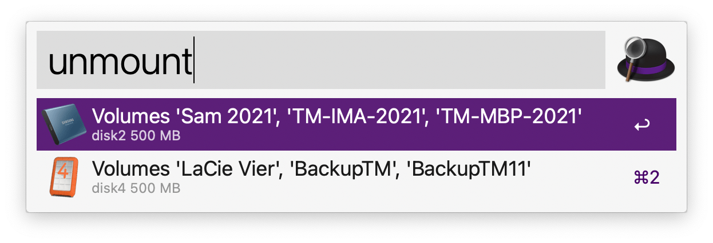

# Alfred-Workflow-unmountDisk
Alfred workflow to help ejecting devices with multiple volumes.

__Warning:__ This Workflow is implemented in Python and uses /usr/bin/python, that is python 2.7 ☹️. Because python 2 is removed from macOS 12.3., use the current version of this workflow, it is contained in my repo ["Collection of my public Alfred Workflows"](https://github.com/Hanspe-3019/workflows). It uses python 3.x 😊. 




Show external devices connected to your Mac and unmount selected physical disk with 
```
     diskutil unmountDisk
```
Using modifier key ⌘ (cmd) will issue

```
     diskutil unmountDisk force 
```

This workflow was created to overcome some shortcomings with Alfred's system command _Eject_, which today does not handle well drives with multiple partitions and snapshots in APFS containers, e.g. time machine volumes with Big Sur.

You can place icon files into directory $ICONDIR to be placed before a device.
Name of icon file is <volumename>.png and $ICONDIR is relative to your home directory, that is ICONDIR=Pictures/icons will point to /Users/userid/Pictures/icons.

If no icon file exits, a default icon 💾 will be used. If there are mutliple partions in the disk, the first icon file found from the disk's volume names will be taken.


## Requirements
 - MacOs
 - [Alfred](https://www.alfredapp.com) 4.+


## Installation

Open file __unmount.alfredworkflow__ with Alfred from Finder.
